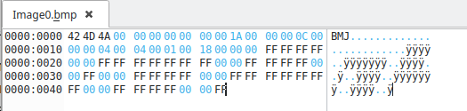
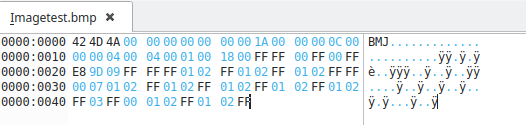
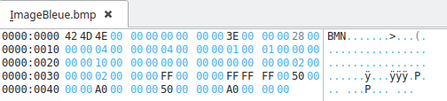
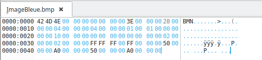
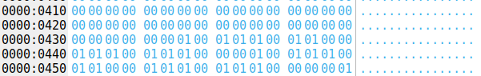

SAE image

Partie A

A.0)
Il faut augmenter la taille du fichier dans oketa de 1.

A.1)

A.2)

A.3)
Le poid de l'image passe de 72 a 102.

1) 24 bits par pixel car c'est toujours marqué 18 à l'endroit qui dit il y a combie de bit par pixel.
2)elle vas de 30 jusqu'a 66 donc 48 octet. On peut aussi le deviner car c'est une image de 16 pixels et que chaque pixels est coder sur 3 octet donc 16*3 = 48.
3)Non 
4)Les pixels sont toujours codé sur 3 octets

A.4)

1) Il y a 1 bit par pixels
2) 16 pixels car l'image a 16 pixels et que chaque pixel est codé sur 1 bit.
3)Oui, il y a une compression.
4)Les couleurs sont codé sur 4 octets et se situe juste après l'entète du fichier.
5)Il y a 2 couleurs dans la palette. Ici dans notre exemple c'est le rouge (00 FF FF 00) et le blanc (FF FF FF 00)
6)Oui il a changé. Maintenant il faut codé un quartet et chaque bit de ce quartet représente un pixel. 1 quartet représente une ligne de notre dammier. Cela donne donc:

R = Rouge
B = Blanc
1010 -> A = BRBR
0101 -> 5 = RBRB
1010 -> A = BRBR
0101 -> 5 = RBRB

Cela nous donne notre dammier rouge et blanc.

7)

8)  

9)  
  

11)  
On peut le trouver à l'adresse 2E.

12)  
On peut trouver le blanc à l'adresse 66

13)  
Le tableau de pixels commence en 76

A.5)  
2)  
j'ai changé le 04 00 00 00 en FC FF FF FF qui représente -4 en complément a 2 sur 32 bits.  

3)  
La hauteur est initialement de A9 01 00 00, inversé cela donne -> 57 FE FF FF.  

A.6)  
1)  
Le poids du fichier est de 60 04 00 00 soit 1120 octets.
Le poids à augmenter car il y a maintenant 256 couleurs possible et le codage des pixels a aussi changer. Cela est du à la compression en RLE.

2)  
La position des pixels sont données en 0A sur 4 octets.

3)  

la couleur 0 représente le rouge et la couleur blanc est représenter par 1.  
01 00 veut dire qu'il y a 1 rouge. le premier octet représente le nombre de pixels et le deuxième représente la couleur qu'ils vont avoir.  
01 01 représente un blanc.  
Dans notre fichier okteta, nous avons 01 00  01 01  01 00  01 01  00 00.  
Tout ces octets représente la première ligne de notre image. Il y a un rouge puis un blanc puis un rouge puis un blanc.  
On met 00 00 pour dire que c'est la fin de ligne.  
2ème ligne: 01 01 01 00 01 01 01 00 00 00 1 blanc,1 rouge,1 blanc,1 rouge, fin de ligne.  
3ème ligne: 01 00 01 01 01 00 01 01 00 00 1 rouge,1 blanc,1 rouge,1 blanc, fin de ligne.  
4ème ligne: 01 01 01 00 01 00 01 01 00 00 1 blanc,1 rouge,1 blanc,1 rouge, fin de ligne.  

A.7)  
1)  
Le poids de image5 est de 1102 octets. Il est plus léger grâce à la compression RLE.  
Cela s'explique car comme dans notre image il y a plusieurs fois ou des même pixels se suivent, la compression en RLE fait qu'ils faut moins de bits pour coder cette suite de même pixels. (1 ligne que de blanc et 2 lignes que de rouge).  

2)  
Le code des pixels est:  
1ère ligne: 04 00 00 00: 4 blancs puis fin de ligne.  
2ème ligne: 04 01 00 00: 4 rouges puis fin de ligne.  
3ème ligne: 04 01 00 00: 4 rouges puis fin de ligne.  
4ème ligne: 01 00 01 01 01 00 01 01 00 00: 1 blanc,1 rouge,1 blanc, 1 rouge, fin de ligne.  

A.8)  
Il m'as fallu modifier la permière ligne (04 00 00 00).  
il faut que je remplace 4 blancs par: 2 blancs, 1 rouge,1 blanc.  
Cela donne donc: 02 00 01 01 01 00 00 00. 2 blancs,1 rouge,1 blanc, fin de ligne.  
J'ai également du modifier la taille de l'image qui est passée à 1106 octets.  
[image hexa nouvelle image](Image6_capture_hexa.png)

A.9)  
J'ai rajouter dans la palette de couleur du vert (00 FF 00 00) et du bleu (FF 00 00 00).  
ensuite j'ai modifier le fichier okteta comme le montre le screen:  
[screen hexa image7](Image7_capture_hexa.png)  
Je n'ai pas du modifier la taille car elle n'as pas changée.  

A.10)  
[image8](Image8.bmp)

[Image9 hexa](Image9_capture_hexa.png)

